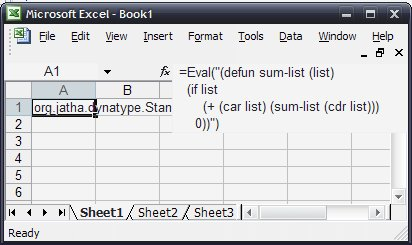

#  XLLoop 
An Example Lisp Function Handler

## About
Included in the download is a function handler for evaluating lisp expressions from Excel. It has the following features:
* Uses the open source lisp implementation Jatha.
* Evaluate an lisp expression with the result being returned in excel form (eg. arrays, string, doubles).
* Dynamically add functions to the lisp environment (using defun).
* The server can evaluate a directory of lisp expressions on startup to customise the lisp environment.

## Excel Example
The following shows an example of creating a new function called "sum-list", which sums the contents of a vector. 

The first screenshot shows the evaluation of a "defun" statement. The return value is a handle to a function.



The second screenshot shows the use of the "sum-list" function to sum the contents of a range.


The third screenshot shows the result.


## Server Code
The following code snippet shows how to create a server for the lisp function handler:
package org.boris.xlloop;

```java
import java.io.File;

import org.boris.xlloop.script.LispFunctionHandler;
import org.boris.xlloop.util.*;

public class LispTest1 
{
    public static void main(String[] args) throws Exception {
        // Create a new function server on default port
        FunctionServer fs = new FunctionServer();
        
        // Create our lisp function handler
        LispFunctionHandler lfh = new LispFunctionHandler();

        // Evaluate any lisp files in this directory (and sub-dirs)
        lfh.eval(new File("functions"), true); 
        
        // Expose a function called "Eval" for the lisp handler
        FunctionInformationRequestHandler firh = new FunctionInformationRequestHandler();
        firh.add(lfh.getInformation()); 

        // Set the function handler
        fs.setFunctionHandler(new DebugFunctionHandler(lfh));
        
        // Set the request handler (for the function information)
        fs.setRequestHandler(new DebugRequestHandler(firh));
        
        // Run the engine
        fs.run();
    }
}
```


